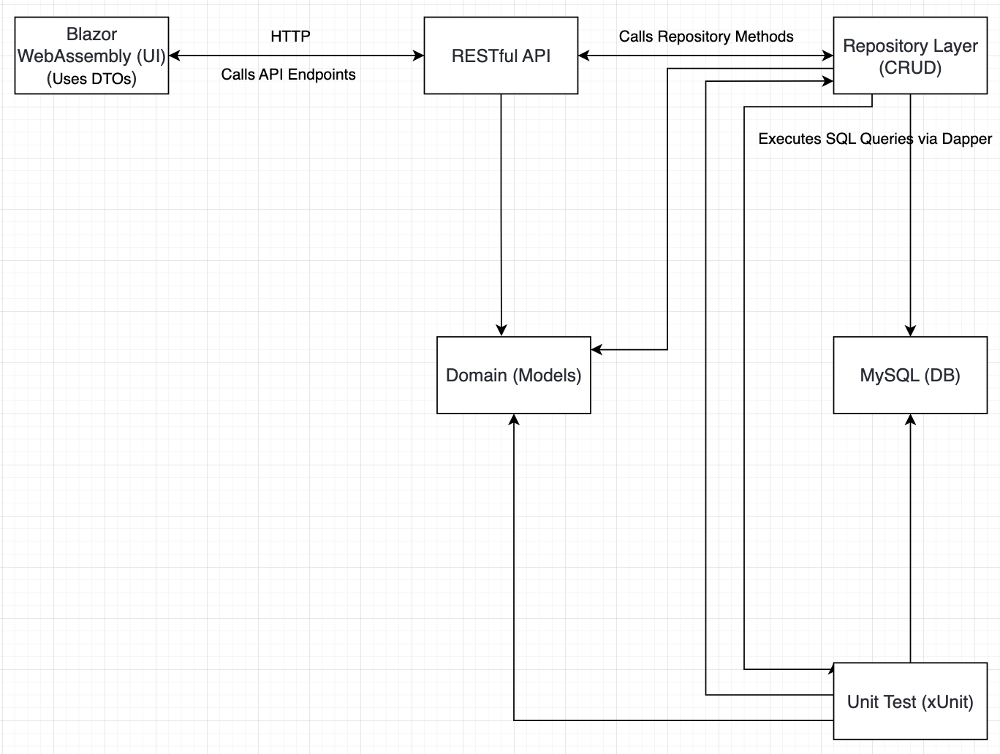
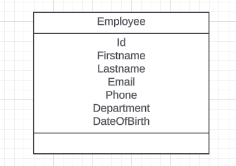
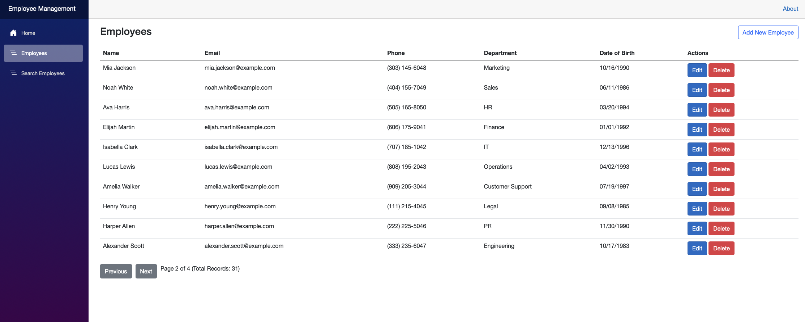
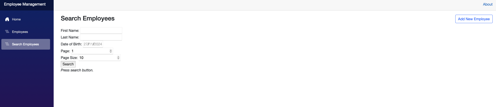
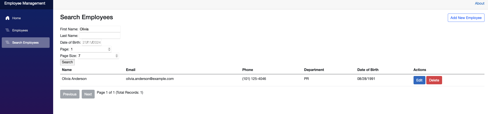
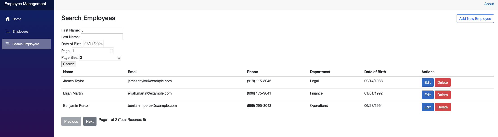
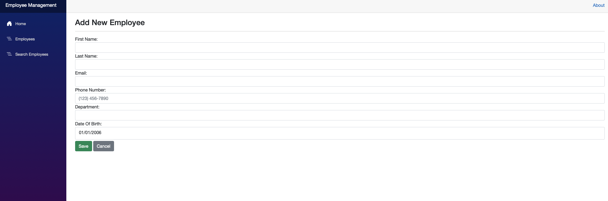
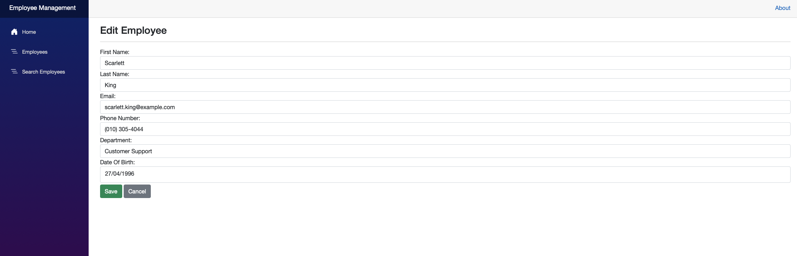
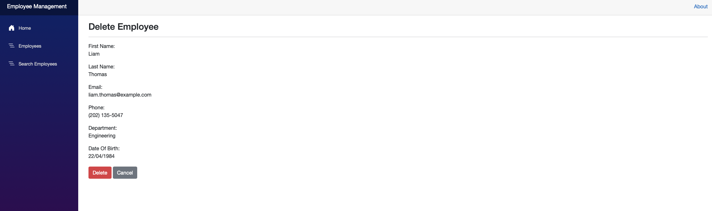

# Employee Management System

##### Overview

    - The Employee Management System is built using .NET Core 8.0 and demonstrates a modular architecture with RESTful APIs, Blazor WebAssembly, and Dapper ORM. The system facilitates the creation, reading, updating, and deletion (CRUD) of employee data in a MySQL database. It adheres to best practices in SOLID principles, MVC architecture, and the Factory pattern.

    This project highlights clear separation of responsibilities:

      • The API Layer exposes endpoints and handles incoming requests.

      • The Repository Layer performs database operations using Dapper.

      • The Blazor WebAssembly frontend provides a user-friendly interface for interacting with employee data.

## System Architecture

### Key Components:

    1. Blazor WebAssembly UI:

      • A modern and interactive frontend to interact with the system.

      • The frontend application where employees interact with the system.

      • Sends HTTP requests to the API layer.

    2. API Layer:

      A RESTful API.

      • Responsible for exposing endpoints to handle HTTP requests.

      • Receives requests from the Blazor frontend and forwards them to the Repository layer.

      • Formats the response and sends it back to the frontend.

    3. Repository Layer:

      • A class library for database interactions using Dapper to perform efficient and lightweight operations on a MySQL database.

    4. Domain Layer:

      • A shared class library containing the business models for employee data.

    5. Unit Tests:

      • An xUnit test project to ensure robust and reliable functionality.

      • Validates the functionality of individual components using xUnit.

      • Includes in-memory testing to simulate database behavior when necessary.

### Features:

      • Separation of Concerns: API and Repository layers are distinct, ensuring modular and maintainable code.

      • RESTful API: Handles requests and communicates with the Repository.

      • MySQL Database: Secure and reliable storage for employee data.

      • Dapper ORM: High-performance and secure database interactions.

      • Blazor WebAssembly: Modern and interactive UI with form validation.

      • Pagination: Efficient handling of large datasets.

      • DotNetEnv: Simplifies secure configuration management.

      • Unit Testing: Comprehensive tests for repositories and endpoints.

## Development Workflow

### Data Flow:

    1. The Blazor WebAssembly frontend sends HTTP requests to the API Layer.

    2. The API Layer validates the request and forwards it to the Repository Layer.

    3. The Repository Layer performs the necessary database operations and returns the result.

    4. The API Layer formats the response and sends it back to the frontend.

### Authentication & Security:

    • Secure environment variable management using .env.

    • Endpoint protection through proper request validation.

## Coding Challenges

### API Development

    • Implement a RESTful API endpoint that accepts JSON payloads for employee data.

    • Validates the endpoints and implment CORS.

    • Ensure requests are validated before forwarding them to the repository.

    • Return meaningful error messages or success responses to the frontend.

### Blazor WebAssembly

    • Create a clean, responsive UI to manage employees.

    • Create a Blazor component to send employee data to the API.

    • Implement form validation to ensure data integrity.

    • Make efficient API calls for CRUD operations and pagination.

    • Ensure a seamless user experience through form validation and feedback.

### Repository Layer

    • Write SQL queries using Dapper to interact with the MySQL database.

    • Handle parameterized queries to avoid SQL injection.

    • Return clean, domain-specific objects to the API.

### Unit Testing

    • Develop unit tests using xUnit to validate API and repository functionalities.

    • Implement in-memory testing to simulate database interactions when applicable.

    • Validate scenarios like successful CRUD operations and invalid inputs.

    • Use xUnit to test repository methods and API endpoints.

## Getting Started

### Prerequisites

    • .NET SDK 8.0
    • MySQL Database

## Installation Steps

    1. Clone the Repository:
      • git clone https://github.com/your-username/EmployeeManagement.git
      cd EmployeeManagement

    2. Setup the Database:
      • Create a MySQL database and the necessary table:

      CREATE TABLE Employees (
          Id INT AUTO_INCREMENT PRIMARY KEY,  -- MySQL uses AUTO_INCREMENT for primary key generation
          FirstName VARCHAR(50) NOT NULL,     -- Use VARCHAR in MySQL instead of NVARCHAR
          LastName VARCHAR(50) NOT NULL,      -- MySQL does not have NVARCHAR; VARCHAR is sufficient
          Email VARCHAR(100) NOT NULL UNIQUE, -- Add NOT NULL and UNIQUE constraint for email
          Phone VARCHAR(20),                  -- VARCHAR works for phone numbers
          Department VARCHAR(50),             -- VARCHAR is fine for department names
          DateOfBirth DATE                    -- DATE is appropriate for storing dates
      );

    3. Environment Configuration:
      • Create a .env file in the root directory and add your connection strings:

        CONNECTIONSTRING="your-database-connection-string"
        CONNECTIONSTRINGTEST="your-test-database-connection-string"

    4. Restore Dependencies:
      dotnet restore

    5. Run the Application:
      • Start the API:
        cd EmployeeManagement.API
        dotnet run

      • Launch the Blazor WebAssembly:
        cd EmployeeManagement.Web
        dotnet run

    6. Run Unit Tests:
      cd EmployeeManagement.Test
      dotnet test

## Features in Detail

### Repository

    • Purpose: Acts as the data access layer, responsible for directly interacting with the database.

      • Core Features:
        • CRUD Operations: Implements Create, Read, Update, and Delete functionalities for employee data.
          • Example: GetEmployeeByIdAsync(int id) retrieves a single employee, while DeleteEmployeeAsync(int id) removes an
          employee by ID.

      • Dapper Integration:
        • Uses lightweight Dapper ORM for SQL operations.

        • Executes parameterized queries to ensure security and prevent SQL injection.

      • Efficient Querying:
        • Supports pagination to handle large datasets efficiently.

        • Fetches only required columns to optimize performance.

      • Testability:
        • Designed to be mocked for unit tests, isolating business logic from the database layer.

        • Supports in-memory database testing for scenarios that don't require a live database.

### RESTful API

    • Purpose: Acts as the intermediary between the frontend (Blazor WebAssembly) and the Repository layer.

    • Core Features:
      • Endpoints:
        • Provides a structured set of endpoints for managing employee data.
          • Example:
            • POST /api/employees for creating an employee.

            • GET /api/employees/{id} for retrieving an employee by ID.

            • PUT /api/employees/{id} for updating an employee's details.

            • DELETE /api/employees/{id} for removing an employee.

      • Data Validation:
        • Ensures incoming requests (e.g., employee creation) are validated before reaching the Repository.

        • Example: Validates required fields like FirstName, LastName, and Email before processing the request.

      • Error Handling:
        • Returns appropriate HTTP status codes (e.g., 200 OK, 400 Bad Request, 404 Not Found, 500 Internal Server Error) for various scenarios.

        • Provides detailed error messages to guide the frontend or users.

      • Security:
        • Sanitizes input and leverages parameterized queries via Repository layer.

        • Configurable with authentication mechanisms for protecting sensitive endpoints.

      • Modular Design:
        • Decouples business logic from the controller methods, adhering to the SOLID principles.

        • Delegates database interaction to the Repository layer, ensuring separation of concerns.

      • Extensibility:
        • Can easily integrate additional features (e.g., search, sorting) without affecting the architecture.

        • Allows for future integrations with third-party services (e.g., email notifications for employee actions).

### Blazor WebAssembly

    • Purpose: Provides the interactive, user-friendly frontend for managing employees.

    • Core Features:
      • Employee Management UI:
        • Includes a dashboard for viewing, adding, editing, and deleting employees.

        • Displays paginated data, ensuring optimal performance for large datasets.

      • Form Handling:
        • Supports detailed forms for employee data input, including validation for fields like Email, Phone, and Date of Birth.

        • Provides immediate feedback for invalid entries, improving user experience.

      • API Integration:
        • Sends HTTP requests to the API for CRUD operations.

        • Automatically handles success and error responses from the API to notify users.

      • State Management:
        • Efficiently manages application state to minimize unnecessary re-renders.

        • Allows seamless navigation between views without reloading the page.

      • Responsive Design:
        • Built with responsiveness in mind, ensuring the interface works across devices like desktops, tablets, and mobile phones.

      • Extensibility:
        • Modular design allows the addition of new features like advanced filtering, bulk updates, or export options.

      • Error Handling:
        • Implements user-friendly error messages and fallback states for API errors, such as timeouts or unauthorized access.

      • Modern UX Features:
        • Search and filtering options for employee data.

        • Real-time updates to reflect changes without requiring full-page refreshes.

### Unit Tests

    • Purpose: Ensures code quality and reliability by testing key components of the system.
      • Core Features:
        • Repository Tests:
          • Verifies the correctness of CRUD methods in the Repository layer.

          • Includes tests for scenarios like:
            • Successful addition of an employee.

            • Retrieving an employee by ID.

            • Deleting non-existent employees.

            • Handling SQL errors gracefully.

      • In-Memory Database Testing:
        • Uses an in-memory database to simulate real-world database behavior.

        • Ensures that queries behave correctly without needing a live database connection.

      • API Tests:
        • Validates API endpoints to ensure proper request handling and responses.

        • Includes tests for expected HTTP status codes, such as 200 OK and 404 Not Found.

      • Blazor Component Tests:
        • (Optional, if implemented) Verifies that Blazor components render correctly and respond to user interactions.

        • Example: Ensures form validation triggers when fields are left empty.

      • Code Coverage:
        • Aims for high test coverage to minimize the chances of undetected bugs.

        • Focuses on critical components, including Repository and API logic.

        • Edge Case Testing:
          • Tests rare or unexpected inputs, such as:
            • Adding employees with invalid data formats.

            • Retrieving employees from an empty database.

            • Handling API timeouts or malformed requests.

## Contribution Guidelines

    1. Fork the repository.

    2. Create a feature branch:
      git checkout -b feature/new-feature

    3. Commit your changes:
      git commit -m "Add a new feature"

    4. Push to the branch:
      git push origin feature/new-feature

    5. Open a Pull Request.

## Contact

    For any queries or feedback, please reach out to:
      • Email: your-email@example.com

      • GitHub: https://github.com/guiandrew-pt

### Screenshots

    1 - Architecture Diagram;

  

    2 - Models Diagram;

  

    3 - Employess list;

  

    4 - Search Employee;

  

    5 - Search Employee result;

  

    6 - Search Employee Result With Pagination;

  

    7 - Add Employee;

  

    8 - Edit Employee;

  

    9 - Delete Employee;

  

